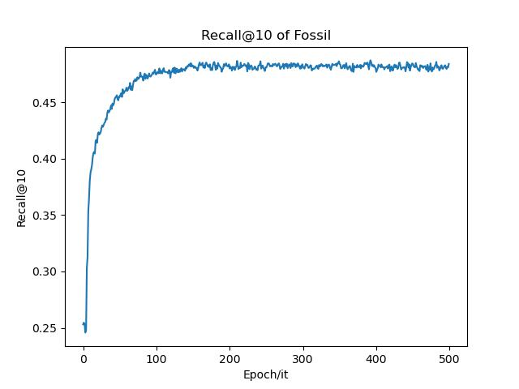
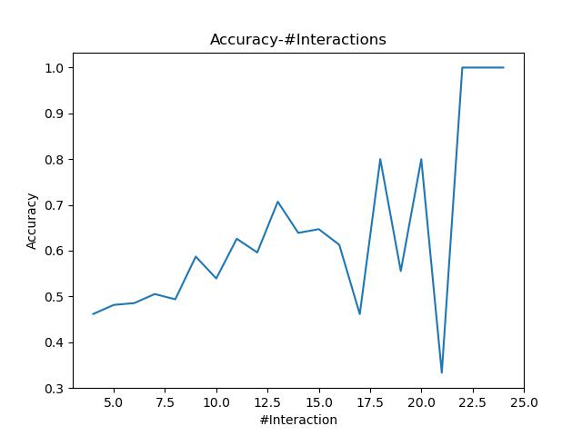

# Fusing Similarity Models with Markov Chains for Sparse Sequential Recommendation (Fossil)

> This is a self-implemented repository for the paper **["Fusing Similarity Models with Markov Chains for Sparse Sequential Recommendation."](https://arxiv.org/pdf/1609.09152)**.

**Requirements**

```
Python                    3.8.15
NumPy                     1.23.4
PyTorch                   1.13.0
```

The code runs well with these requirements. While the code is simple, I believe it will also run well with some higher or lower versions of these packages.

**Usage**

Usage is simple, just run:

```
python entry.py
```

then everything goes well.

---

**Results**

The algorithm results after 500 epochs' training is as below:




